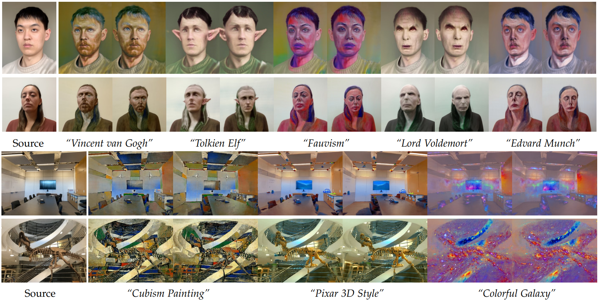

# Nerf-Art: Text-Driven Neural Radiance Fields Stylization

### [Project Page](https://cassiepython.github.io/nerfart/index.html) | [Paper (ArXiv)](https://arxiv.org/abs/2212.08070) | [Data](https://drive.google.com/drive/folders/12zOhjv4CrUC-z3n4uF-qHNrT7doZcsVA?usp=share_link)



## Abstract
As a powerful representation of 3D scenes, Neural radiance fields (NeRF) enable high-quality novel view synthesis given a set of multi-view images. Editing NeRF, however, remains challenging, especially on simulating a text-guided style with both the appearance and the geometry altered simultaneously. In this paper, we present NeRF-Art, a text-guided NeRF stylization approach that manipulates the style of a pre-trained NeRF model with a single text prompt. Unlike previous approaches that either lack sufficient geometry deformations and texture details or require meshes to guide the stylization, our method can shift a 3D scene to the new domain characterized by desired geometry and appearance variations without any mesh guidance. This is achieved by introducing a novel global-local contrastive learning strategy, combined with the directional constraint to simultaneously control both the trajectory and the strength of the target style. Moreover, we adopt a weight regularization method to effectively suppress the cloudy artifacts and the geometry noises when transforming the density field for geometry stylization. Through extensive experiments on various styles, our method is demonstrated to be effective and robust regarding both single-view stylization quality and cross-view consistency.
## Setup
### Installation
Clone the repository:
```
git clone https://github.com/cassiePython/NeRF-Art
```

To install the dependencies, we recommend using [Anaconda](https://www.anaconda.com/products/individual) and run the following commands:
```
conda create -n nerfart python=3.8
conda activate nerfart

conda install pytorch==1.8.1 torchvision==0.9.1 torchaudio==0.8.1 cudatoolkit=10.2 -c pytorch
# if you use RTX 30XX GPUs, please use the following command instead
# pip install torch==1.8.1+cu111 torchvision==0.9.1+cu111 torchaudio==0.8.1 -f https://download.pytorch.org/whl/torch_stable.html

pip install -r requirements.txt
pip install ftfy regex tqdm
pip install git+https://github.com/openai/CLIP.git
```
Alternatively, you can use `source setup_env.sh` to install the dependencies.


### Using our data
Download the data from [here](https://drive.google.com/drive/folders/12zOhjv4CrUC-z3n4uF-qHNrT7doZcsVA?usp=share_link), extract and put each of them under `./data/`. They should be organized as follows:
```

data/
├── fangzhou_nature/
    ├── images/
    ├── matte/
    ├── cameras.npz
    ├── database.db
    ├── pose_bounds.npy
    ...
...
```

### [Optional] Using custom data
Please refer to [data_guide.md](./data_guide.md) to process and use your own data.
### Pretrained Models
Several pre-trained checkpoints are provided. Download them and put under `./pretrained` folder.  

[Reconstruction Checkpoints](https://drive.google.com/drive/folders/1ikNT0nxA7uMoezIn75bp7VAIz05UYfYJ?usp=sharing) | [Stylized Checkpoints](https://drive.google.com/drive/folders/14uENGC2grnjoyuKZdS-slQtCmOWduz6u?usp=sharing)


## Running the Code

### Rendering
Use following command for multiple views rendering, this should work for both NeuS and VolSDF. The results will be saved in the `./out` folder. Notice that, when rendering there must be corresponding scene data (imgs and cameras) under `./data` folder.

```
python render.py  --config ./configs/volsdf_fangzhou_vangogh.yaml \
--load_pt ./pretrained/volsdf_fangzhou_vangogh.pt --downscale 2 --H 480 --W 270 \
--exp_name volsdf_fangzhou_vangogh  --num_views 90  --save_images 
```
For reference, it takes around 30 minutes to render 90 views on a single RTX 3090 GPU.


### Training
To be released soon.

## Others
This implementation is based on [neurecon](https://github.com/ventusff/neurecon). Thanks for their great work.
